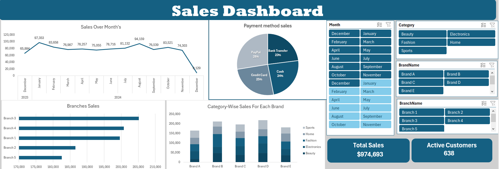

# 🧾 Sales Dashboard (Excel Project)

## 📊 Project Overview

This project focuses on analyzing and visualizing sales data using Microsoft Excel.
The goal was to clean, validate, and transform raw data, then design an interactive Sales Dashboard that provides useful business insights about sales performance across months, categories, brands, branches, and payment methods.

## 🧹 Data Cleaning and Preparation (Power Query)

The raw data was imported into Power Query and cleaned through the following steps:

1. Checked for null values and replaced them with zero.
2. Removed duplicate records to ensure data accuracy.
3. Verified and corrected data types for each column.
4. Checked for errors and validated all data before loading it.
5. Created relationships between the tables for proper data modeling.

## 🧮 Data Modeling and Calculations (DAX)

Created DAX measures to calculate:
1. Total Sales = SUM of all sales transactions.
2. Active Customers = COUNT of unique customers who made purchases.

## 📈 Data Analysis (Pivot Tables)

Used Pivot Tables to analyze sales from different perspectives:
1. Sales by Brand
2. Sales by Category
3. Sales by Month and Year
4. Sales by Branch
5. Sales distribution by Payment Method

## 🎨 Dashboard Design

Designed an interactive Sales Dashboard to visualize key insights, including:
1. Sales trend over months
2. Top performing branches
3. Category-wise brand performance
4. Payment method breakdown
5. Overall KPIs like Total Sales and Active Customers

## 🧠 Key Insights

1. Identified sales trends across different months.
2. Compared performance between brands and branches.
3. Analyzed the most used payment methods.
4. Highlighted key KPIs for better business decisions.

## 🛠 Tools Used

1. Microsoft Excel
2. Power Query (for cleaning and transformation)
3. DAX formulas
4. Pivot Tables
5. Charts and Visuals for Dashboard design

## 👩‍💻 Author

Merna Hatem
Data Analyst | Excel | Power BI | SQL | Python
